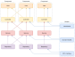

# Заметки 

## 1. Описание

### 1.1 Цель создания приложения

Приложение написано после прочтения статьи на
Хабре : [Чистая Архитектура для веб-приложений](https://habr.com/ru/post/493430/) 
.

Захотелось попробовать чистую архитектуру в действии.

В данном репозитории используется фреймворк Angular .

Также приложение реализовано на фреймворках React  и Vue  (в других
моих репозиториях).

### 1.2 Про приложение

Само приложение представляет собой SPA  приложение для заметок.

Каждая заметка имеет название и список задач. Каждая
задача имеет текст и чекбокс, говорящий о её завершённости.

На главной странице показано количество заметок.

На странице "Все заметки" показан список всех заметок. У каждой заметки показано только 3 первые задачи. Можно открыть
заметку и посмотреть все задачи в ней.

На странице "Новая заметка" можно создать заметку: ввести заголовок заметки, добавить задачи, ввести их заголовки и их
статус - завершённые или нет.

Также заметку можно отредактировать, изменяя данные в ней. При сохранении изменений или удалении заметки появляется
модальное окно с подтверждением действия.

Заметки сохраняются в Local Storage браузера.

Также при создании новой заметки или редактировании существующей имеется возможность выполнить отмену/повтор последних
действий.

### 1.3 Стили

Для стилизации используется библиотека Bootstrap .

### 1.4 Язык программирования

Приложение написано на языке Typescript .

### 1.5 Фреймворк

Фронтенд-фреймворк - Angular .

## 2. Настройка приложения с нуля 

### 2.1 Создать приложение angular

* **ng new todos_angular**

### 2.2 Инициализировать eslint :

* **ng add @angular-eslint/schematics**

### 2.3 Установить зависимости

* **npm i -D prettier** 
* **npm i -D prettier-eslint eslint-config-prettier eslint-plugin-prettier**
*
  * **npm i -D @types/node**

* **npm i bootstrap@5.3.0-alpha1**
* **npm i bootstrap-icons**

* **npm i first-di**
* **npm i class-validator**
* **npm i reflect-metadata**
* **npm i ts-serializable**
* **npm i typeorm**

* **npm i axios**

* **npm i node-sass**
* **npm i save-dev**

### 2.4 Добавить в файл angular.json:

```
  {
    "projects": {
      "to-dos-ng": {
        "architect": {
          "build": {
            "options": {
              "styles": [
                "node_modules/bootstrap/dist/css/bootstrap.min.css",
                "node_modules/bootstrap-icons/font/bootstrap-icons.css",
                "src/styles.scss"
              ],
              "scripts": [
                "node_modules/bootstrap/dist/js/bootstrap.min.js"
              ]
            }
          }
        }
      }
    },
    "cli": {
      "schematicCollections": [
        "@angular-eslint/schematics"
      ],
      "analytics": false
    }
  }
```

### 2.5 Добавить в файл .eslintrc.json:

```
{
  {
    "extends": [
      // ...
      "plugin:prettier/recommended",
      "prettier"
    ],
    // ...
  },
    "files": [
      "*.html"
    ],
    "excludedFiles": [
      "*inline-template-*.component.html"
    ],
    "extends": [
      "plugin:@angular-eslint/template/recommended",
      "plugin:prettier/recommended",
      "prettier"
    ],
    "rules": {
        "prettier/prettier": [
          "error",
          {
            "parser": "angular"
          },
          {
            "endOfLine": "auto"
          }
        ]
      }
  }
}
```

### 2.6 Создать файл .prettierrc и добавить в него:

```
{
  "semi": true,
  "trailingComma": "none",
  "singleQuote": false,
  "printWidth": 80,
  "tabWidth": 2,
  "useTabs": false,
  "arrowParens": "avoid",
  "endOfLine": "auto"
}
```

### 2.7 Создать файл .prettierignore и добавить в него содержимое файла .gitignore.

### 2.8 В файле tsconfig.json включить:

```
{
  "compilerOptions": {
    "emitDecoratorMetadata": true, // Позволяет генерировать рефлексию
    "allowSyntheticDefaultImports": true,
    "jsx": "react"
  }
}
```

### 2.9 В файле .editorconfig включить:

```
[*]
end_of_line = lf
```

### 2.10 В IDE  включить опции:

#### Settings/Languages & Frameworks/Javascript/Prettier:

* Prettier package: выбрать текущий каталог - **...\node_modules\prettier**
* поставить галочку - **On 'Reformat Code' action**
* поставить галочку - **On save**

#### Settings/Tools/Action on Save:

* поставить галочку - **Reformat code**
* поставить галочку - **Run eslint --fix**
